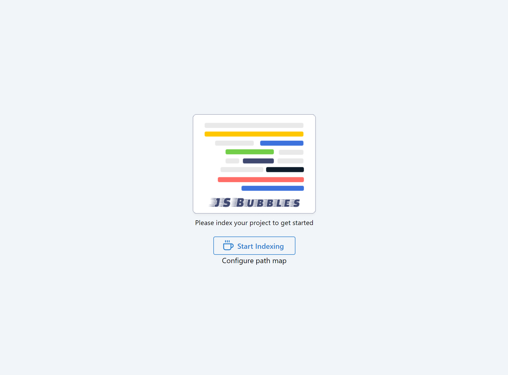

JSBubbles is a VSCode extension which makes it easy to find and read JavaScript without switching back and forth between multiple files.

JSBubbles is inspired by [Code bubbles](http://www.andrewbragdon.com/codebubbles_site.asp) and few ideas of [the Light table IDE](https://www.chris-granger.com/2012/04/12/light-table-a-new-ide-concept/).

## Getting started

- Install the extension from [marketplace](https://marketplace.visualstudio.com/items?itemName=Raathigeshan.js-bubbles).
- Click on the  icon on the top right corner of any file to open the JS Bubbles panel.

## Using JS Bubbles

### Indexing your project

- When you open the extension, you will be prompted to index your project.
  

- If you use path alias (like Webpack's resolve rules), make sure to click the **"Configure path map"** and add your module alias rules in the UI.

- Then go ahead and click **"Start Indexing"**. This will take a few minutues.

### Using JS Bubbles to navigate and read code

  

- Once the indexing completes, you can search for any symbol in your project using the fuzzy search bar.

- Once your add a symbol to the stage, you can click on the highlighted markers to open other connecting symbols.

- You can also move the symbols on the stage around as you prefer.

- Closing a symbol will also close all the other symbols connected to it.
